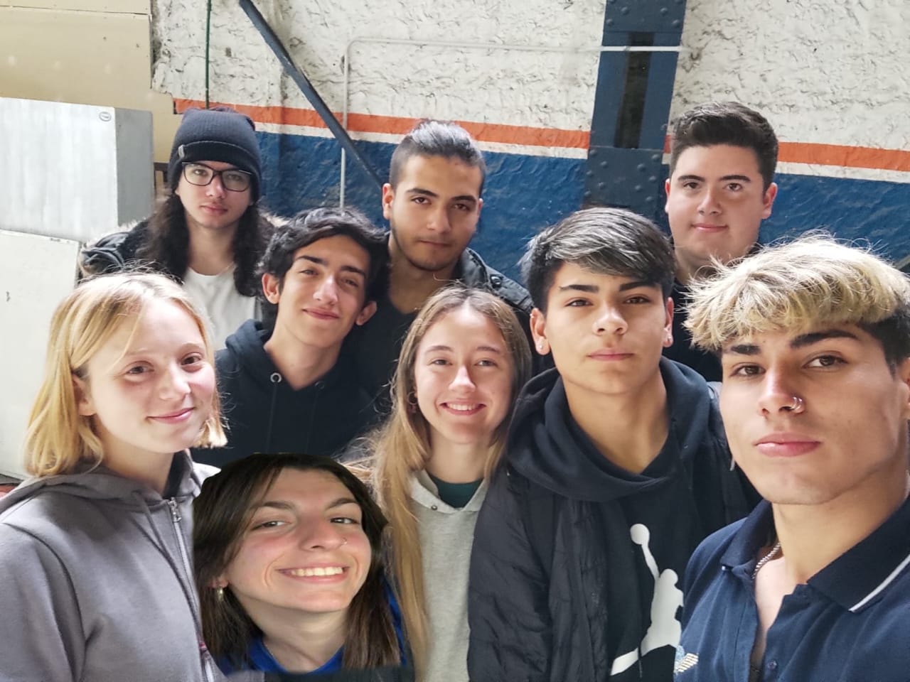

+# *Twin Otter*

# Información del proyecto
 En este proyecto se trata de una cabina de un Twin Otter, el cual fue proporcionado por la escuela. Nosotros vamos a restablecerla para el uso didactico.

# Objetivo del Proyecto

El objetivo es reacondicionar una cabina de twin otter, realizando la instalación de instrumental para poder realizar ensayos y simulaciones a partir de la teoría, y de esta manera capacitar a los futuros técnicos en el conocimiento de los sistemas de navegación.

# Como funciona?
A partir de una fuente regulada de 28V se alimentarán todos los instrumentos.
Al no tener un sistema pitot-estática funcional, decidimos crear un código sobre un Arduino mediante el cual, a través de motores paso a paso, gire la aguja y muestre en la cartilla el valor ingresado, el cual será de velocidad, velocidad vertical y/o altitud.
Los instrumentos digitales presentan distintos módulos y antenas que pondrán en funcionamiento su sistema interno.

# Quienenes lo desarrollaron?

Somos alumnos de 7mo 1ra Avionica de la escuela secuandaria tecnica N° 7 de Quilmes interesados en dejar un objeto didactico para los mas chicos de la escuela.

# *Integrantes*

### Ayala, Joaquin Edgardo         
GitHub: joaco1211
Mail: joaco121109@gmail.com
Instagram :

### Distefano, Ana Caterina
GitHub: anaadistefano
Mail: distefanoana16@gmail.com
Instagram : anaadistefano

### Gregorini, Sofia Belen
GitHub: sofiagregorini
Mail: Sofiabelengregorini@impatrq.com
Instagram : 

### Iglesias, Santiago Oscar
GitHub: Santiag0
Mail: Santiglesias2580@gmail.com
Instagram : 

### Parlapiano, Federico
GitHub: Fedeparla19
Mail: Federicoparla92@gmail.com
Instagram : fedeparla__17

### Petrone Medina, Nahuel
GitHub: nahuelPM
Mail: nahuelpetro03@gmail.com

### Radino, Mauro Ian  
GitHub: mauroradino
Mail: mauroradino2003@gmail.com
Instagram : mauroradino01

### Suarez Pavicich, Maria Luana
GitHub: Marilu-su
Mail: Mluanasuarez@gmail.com
Instagram : Luu.suuarez

### Zocco, Franco Fabrizio         
GitHub: 
Mail: 
Instagram : 
